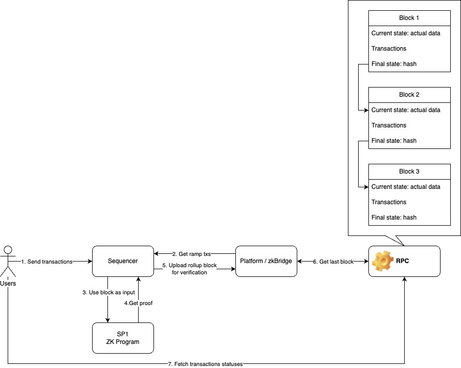

# ZK Bridge

## Overview

The zk bridge is a program that allows users to create zkSVM rollups, bridge funds to it, and verify zk proofs of execution.



## Testing

The current test sequence involves two participants A and B:
1. A and B both start with 10 SOL
2. A send 1 SOL to the rollup
3. A calls a Counter program on the rollup
4. A sends some SOL to B on the rollup
5. B withdraws the SOL from the rollup

To run the test:

```bash
cd onchain
anchor test
```